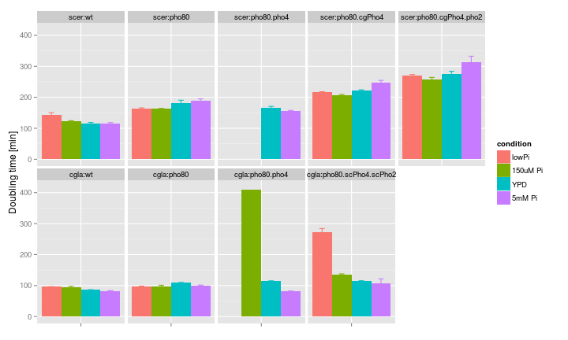

Growth curve analysis | data: 20131001
========================================================
This script does some data plotting and quality check
for my first Bioscreen-C experiment  
hebin  
3 oct 2013

Experiment
------------------
30C; 48h; split into two segments at 23h points

Read data
------------------
Notes:  
* change the working directory
* replace the filename with the appropriate name

```r
setwd("~/Documents/work/Pho/Result/Multiple_stress_growth/20131001")
raw <- read.csv("BioscreenExperiment20131001.csv", as.is = TRUE)
raw <- raw[-1, ]
raw1 <- read.csv("BioscreenExperiment20131002.csv", as.is = TRUE)
raw1 <- raw1[-1, ]
# note 1: this time I had the experiment done in two separate runs. The
# 0:00:04 is equivalent to 22:46:05 note 2: each column is temporal data
# for one well note 3: throw away the first row of each dataset
time <- seq(from = 0.25, by = 0.25, length.out = nrow(raw))
time <- c(time, seq(from = time[length(time)] + 0.5, by = 0.25, length.out = nrow(raw1)))
data <- as.matrix(rbind(raw[, -1], raw1[, -1]))
use.time <- 5:nrow(data)  # time axis: throw away first hour of data and the last time point
use.wells <- 11:130  # columns: discard the first column, or 10 wells, which are just water
data <- data[use.time, use.wells]
Time <- time[use.time]
attr(Time, "unit") <- "hr"
```


Design matrix
------------------
* define the strains
* define all factors involved
* setup the design matrix

```
## Well layout
```

```
##  [1] "lowPi"    "lowPi"    "lowPi"    "YPD"      "YPD"      "YPD"     
##  [7] "5mM Pi"   "5mM Pi"   "5mM Pi"   "150uM Pi" "150uM Pi" "150uM Pi"
```

```
##       [,1]    [,2]    [,3]    [,4]    [,5]    [,6]    [,7]    [,8]   
##  [1,] "empty" "EY690" "EY690" "EY690" "EY690" "EY690" "EY690" "EY690"
##  [2,] "empty" "XZ30"  "XZ30"  "XZ30"  "XZ30"  "XZ30"  "XZ30"  "XZ30" 
##  [3,] "empty" "XZ33"  "XZ33"  "XZ33"  "XZ33"  "XZ33"  "XZ33"  "XZ33" 
##  [4,] "empty" "XZ109" "XZ109" "XZ109" "XZ109" "XZ109" "XZ109" "XZ109"
##  [5,] "empty" "XZ112" "XZ112" "XZ112" "XZ112" "XZ112" "XZ112" "XZ112"
##  [6,] "empty" "CG1"   "CG1"   "CG1"   "CG1"   "CG1"   "CG1"   "CG1"  
##  [7,] "empty" "CG2"   "CG2"   "CG2"   "CG2"   "CG2"   "CG2"   "CG2"  
##  [8,] "empty" "CG4"   "CG4"   "CG4"   "CG4"   "CG4"   "CG4"   "CG4"  
##  [9,] "empty" "CG22"  "CG22"  "CG22"  "CG22"  "CG22"  "CG22"  "CG22" 
## [10,] "empty" "empty" "empty" "empty" "empty" "empty" "empty" "empty"
##       [,9]    [,10]   [,11]   [,12]   [,13]  
##  [1,] "EY690" "EY690" "EY690" "EY690" "EY690"
##  [2,] "XZ30"  "XZ30"  "XZ30"  "XZ30"  "XZ30" 
##  [3,] "XZ33"  "XZ33"  "XZ33"  "XZ33"  "XZ33" 
##  [4,] "XZ109" "XZ109" "XZ109" "XZ109" "XZ109"
##  [5,] "XZ112" "XZ112" "XZ112" "XZ112" "XZ112"
##  [6,] "CG1"   "CG1"   "CG1"   "CG1"   "CG1"  
##  [7,] "CG2"   "CG2"   "CG2"   "CG2"   "CG2"  
##  [8,] "CG4"   "CG4"   "CG4"   "CG4"   "CG4"  
##  [9,] "CG22"  "CG22"  "CG22"  "CG22"  "CG22" 
## [10,] "empty" "empty" "empty" "empty" "empty"
```


Functions
-----------------
1. Extract data
`getWell <- function(cond, strain, index, range=c(1:10))` extract one well's time series
`getExp <- function(strain, cond, range=NA)`  extract all tech. repl. of one strain x condition


2. Subfunction to summarize data
`myMeanSD <- function(x, d)`  summarize data
`myMelt <- function(x, d)`  summarize data

```
## Loading required package: reshape2
```


3. Simple plotting function
`simplot <- function(ex, mode="basic")` plot the raw data in either untransformed or log2 transformed format, can handle multiple wells simultaneously

```
## Loading required package: ggplot2
```


4. Estimate growth rate


Analyse
-----------------

### 0. Quality control
This time, some "empty" wells showed growth. In particular, the additional 3 columns of low Pi (well201-well230) seem to be most affected

```r
simplot(ex = getExp(strain = "empty", cond = 1:4, range = 1:178))
```

```
## Warning: Removed 972 rows containing missing values (geom_path).
```

 


### 1. Overview and comparisons between strains / conditions
 


### 2. Estimate growth rate from the curve
In this section, I would like to compute two statistics for each growth curve
(1) Growth rate during the exponential stage, and
(2) Final biomass yield

For #1, the procedures are as follows
* Determine the linear range (there should be little lag time)
* Linear fit on log2(OD) ~ Time(hr)
* Extract the doubling time by calculating 1/coef(fit)[2]
* An alternative method is to calculate the derivative at discreet time points and take the maximum rate


```
##                     strain   lowPi 150uM Pi   YPD 5mM Pi
## 1                  scer:wt  142.43   123.16 116.0 115.70
## 2               scer:pho80  163.91   162.35 181.0 189.57
## 3          scer:pho80.pho4 4672.62   956.19 165.3 155.29
## 4        scer:pho80.cgPho4  215.72   206.28 222.3 248.42
## 5   scer:pho80.cgPho4.pho2  269.85   256.47 276.5 312.62
## 6                  cgla:wt   95.92    95.41  86.0  83.09
## 7               cgla:pho80   97.24    98.36 109.0 100.69
## 8          cgla:pho80.pho4 3004.83   408.56 113.9  81.81
## 9 cgla:pho80.scPho4.scPho2  272.84   134.23 114.1 108.55
```

```
## Warning: Removed 4 rows containing missing values (geom_path).
```

 

