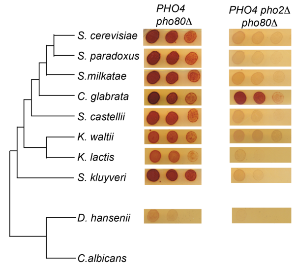

Purpose
--------
This file takes in motif (CACGTG) counts generated using the RSAT tool [fungi.rsat.eu] and summarizes the pattern

Species
--------


Choose species to investigate based on this phylogenetic distribution:

*S. cerevisiae, C. glabrata, S. castelli, K. lactis, S. kluyveri, D. hansenii, C. albicans, Y. lipolytica*

Functions
---------

```r
myCount <- function(name = "Scer"){
  filenames <- paste("./data/Motif_Count",name,"upstream_800bp",c("noorf","all"),sep="_")
  filenames <- paste(filenames,"txt",sep=".")
  noorf <- read.table(filenames[1], comment.char=";",head=F,as.is=T)
  all <- read.table(filenames[2], comment.char=";",head=F,as.is=T)
  count <- c(gene.all = nrow(all), gene.noorf = nrow(noorf), 
             motif.all = sum(all[,4]), motif.noorf = sum(noorf[,4]))
  return( count )
}
require(plyr)
```

```
## Loading required package: plyr
```

Analysis
--------

```r
species <- c("Scer","Cgla","Scas","Sklu","Klac","Dhan","Calb")
genome.size <- c("Scer"=12.2, "Cgla"=12.3, "Scas"=11.4, "Sklu"=11.0, "Klac"=10.7, "Dhan"=12.2, "Calb"=14.3)
orf.num <- c("Scer"=6692, "Cgla"=5165, "Scas"=4677, "Sklu"=2968, "Klac"=5327, "Dhan"=6354, "Calb"=6093)
Count <- sapply(species, myCount)
Res <- data.frame(Name=species, Size=genome.size, ORF=orf.num, t(Count))
print(Res)
```

```
##      Name Size  ORF gene.all gene.noorf motif.all motif.noorf
## Scer Scer 12.2 6692      530        397       608         455
## Cgla Cgla 12.3 5165      324        299       361         334
## Scas Scas 11.4 4677      459        366       509         401
## Sklu Sklu 11.0 2968      892        786      1123         998
## Klac Klac 10.7 5327     1358       1287      1678        1583
## Dhan Dhan 12.2 6354      722        686       744         700
## Calb Calb 14.3 6093      586        520       615         546
```
