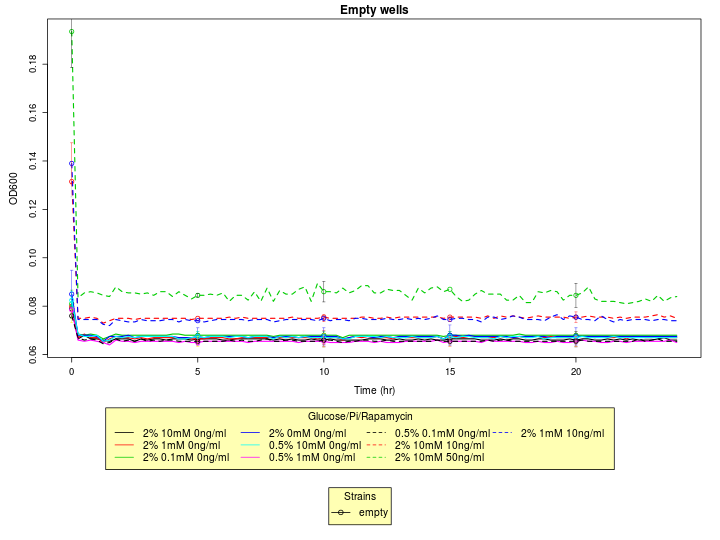
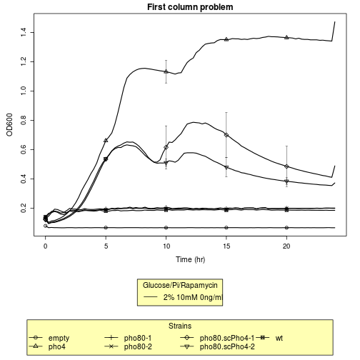
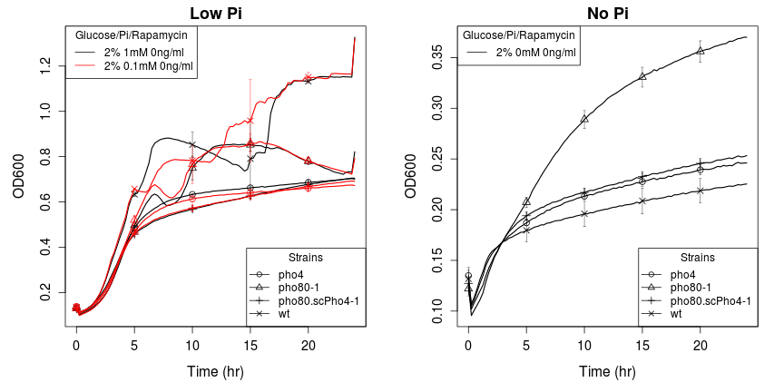
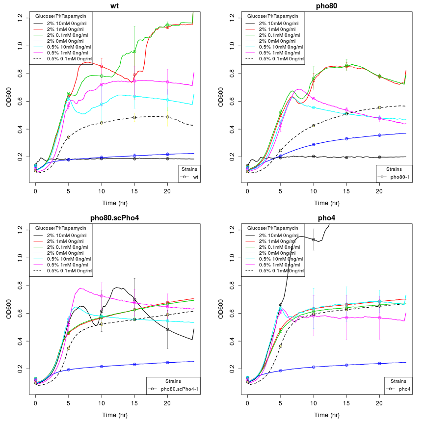
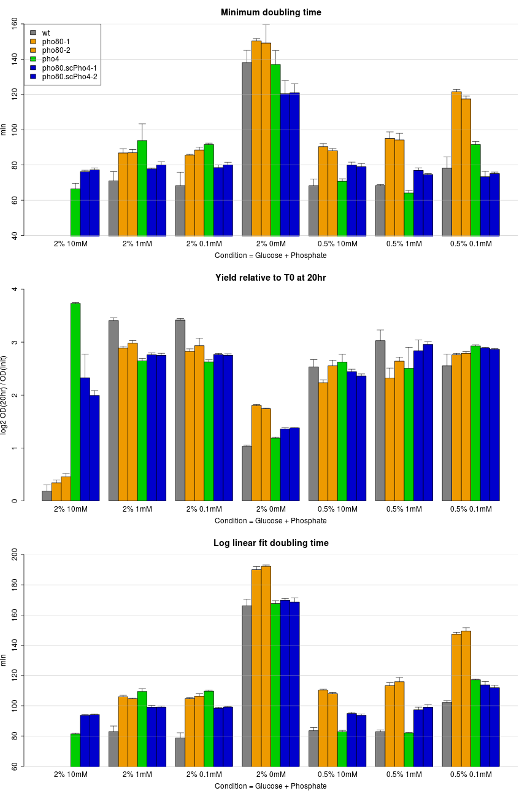

Growth curve analysis | data: 08/17/2013
========================================================
This script does some data plotting and quality check
for my first Bioscreen-C experiment  
hebin  
17 aug 2013  

Summary
------------------
1. The rich media condition is abnormal -- the first column on plate A didn't grow / _pho4_ (CG3) grows the best under this condition / the saturation yield of _pho4_ is the highest among all experimental conditions
2. 

Read data
------------------
Notes:  
* change the working directory
* replace the filename with the appropriate name

```r
raw <- read.csv("BioscreenExperiment20130816.csv")
# note: each column is temporal data for one well
data <- as.matrix(raw[, -1])
```


Design matrix
------------------
* define the strains
* define all factors involved
* setup the design matrix

```
## Strains
```

```
## [1] "wt"             "pho80-1"        "pho80-2"        "pho4"          
## [5] "pho80.scPho4-1" "pho80.scPho4-2" "empty"
```

```
## Each strain is tested in the following 10 conditions
```

```
##    Glucose    Pi Rapamycin
## 1       2%  10mM    0ng/ml
## 2       2%   1mM    0ng/ml
## 3       2% 0.1mM    0ng/ml
## 4       2%   0mM    0ng/ml
## 5     0.5%  10mM    0ng/ml
## 6     0.5%   1mM    0ng/ml
## 7     0.5% 0.1mM    0ng/ml
## 8       2%  10mM   10ng/ml
## 9       2%  10mM   50ng/ml
## 10      2%   1mM   10ng/ml
```


Functions
-----------------
1. Subfunction to summarize, extract data
`myMeanSD <- function(x, d)`  
`extract1Col <- function(x, d, cond, strain, index, range=c(1:10))`


2. Simple plotting function
`simplot <- function(ex, mode="basic")`


2. A function to visualize the time course for any given strain at a particular condition  
`plotTrace <- function(x, d, strain, cond, ylim=NA, lwd=1)`  


3. Based on plotTrace, but plot the mean of tech. repl.  
`plotMeanTrace <- function(X, strain, cond, title="", ylim=NA, lwd=1)`  
`plainMeanTrace <- function(X, strain, cond, title="", ylim=NA, lwd=1)`  
  _Same as plotMeanTrace, except it doesn't try to plot the legend_


4. Estimate growth rate


Analyse
-----------------
### 1. Quality check
### _Negative controls_
The last well of each column has no cells in it. Plotting the OD of the 20 empty wells should be background.
Notice that rapamycin adds to the background. My current analysis didn't remove the background.

```r
x = myMeanSD(data, design.mat)
plotMeanTrace(x, "empty", 1:10, title = "Empty wells", lwd = 1.5)
```

 


### _But something is wrong with the first column_
Notice the flat line including the wt, the two pho80 strain, all of which are in the first column
Also notice that the rest three strains shared a similar pattern, i.e. there is a peak at ~6h, then a drop, followed by a recovery. In the case of pho80.scPHO4, there is a subsequent drop. The _pho4_ strain seems to do particularly well in this condition. By the end it still doesn't seem to saturate.  

```r
plotMeanTrace(x, "all", 1, lwd = 1.5, title = "First column problem")
```

 

__Questions 1.__ Why is there a drop in OD at ~6hr, what is limiting?
_Calculate the rate of Pi consumption in rich media_
My estimate 


### 2. Overview and comparisons between strains / conditions
### _Starved for Pi_
The biological replicates (pho80 and pho80.scPHO4) are quite similar. From now on I just plot one of them

```r
st.use <- c("wt", "pho80-1", "pho4", "pho80.scPho4-1")
layout(matrix(c(1, 2), ncol = 2))
plainMeanTrace(x, st.use, c(2:3), lwd = 1.5, title = "Low Pi")
plainMeanTrace(x, st.use, 4, lwd = 1.5, title = "No Pi")
```

 


### _Starved for Glucose (and Pi)_

```r
layout(matrix(c(1, 2), ncol = 2))
plainMeanTrace(x, st.use, 5, lwd = 1.5, ylim = c(0.06, 1.2), title = "Low Glucose")
plainMeanTrace(x, st.use, c(6, 7), lwd = 1.5, ylim = c(0.06, 1.2), title = "Low Glucose + Low Pi")
```

 


### _Comparison grouped by strains, not conditions_

```r
layout(matrix(c(1:4), byrow = TRUE, ncol = 2))
plainMeanTrace(x, "wt", 1:7, lwd = 1.5, ylim = c(0.06, 1.2), title = "wt")
plainMeanTrace(x, "pho80-1", 1:7, lwd = 1.5, ylim = c(0.06, 1.2), title = "pho80")
plainMeanTrace(x, "pho80.scPho4-1", 1:7, lwd = 1.5, ylim = c(0.06, 1.2), title = "pho80.scPho4")
plainMeanTrace(x, "pho4", 1:7, lwd = 1.5, ylim = c(0.06, 1.2), title = "pho4")
```

 


### 3. Estimate growth rate from the curve
In this section, I'd like to compute two statistics for each growth curve
(1) Growth rate during the exponential stage, and
(2) Final biomass yield

For #1, the procedures are as follows
* Determine the linear range (there should be little lag time)
* Linear fit on log2(OD) ~ Time(hr)
* Extract the doubling time by calculating 1/coef(fit)[2]
* An alternative method is to calculate the derivative at discreet time points and take the maximum rate

For #2, I will measure the rate at 20hr time point
 

#### Example: 
