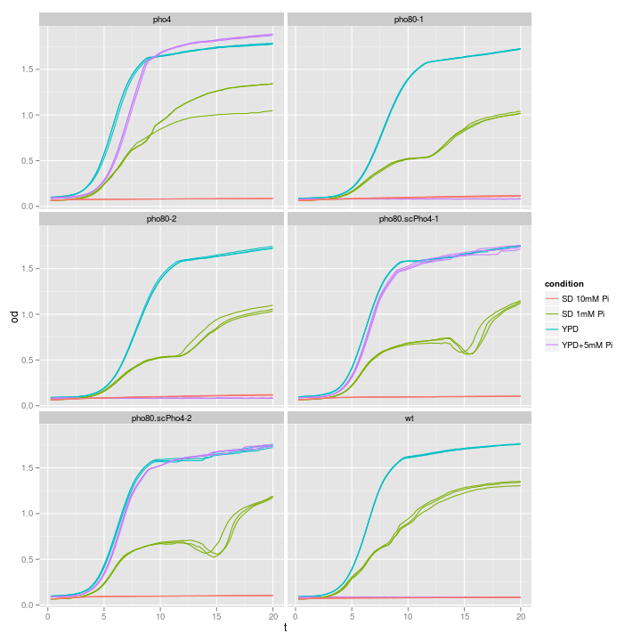
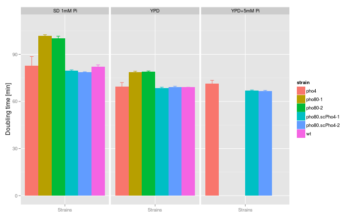

Growth curve analysis | data: 08/27/2013
========================================================
This script does some data plotting and quality check
for my first Bioscreen-C experiment  
hebin  
29 aug 2013  

Summary
------------------

Read data
------------------
Notes:  
* change the working directory
* replace the filename with the appropriate name

```r
raw <- read.csv("BioscreenExperiment20130827.csv")
# note: each column is temporal data for one well

data <- as.matrix(raw[, -1])
data <- data[-c(1, nrow(data)), -c(1:10, 91:100)]  # the left and right are left blank
Time <- seq(0.25, 25.75, 0.25)
attr(Time, "unit") <- "hr"
```


Design matrix
------------------
* define the strains
* define all factors involved
* setup the design matrix

```
## Strains
```

```
## [1] "wt"             "pho80-1"        "pho80-2"        "pho4"          
## [5] "pho80.scPho4-1" "pho80.scPho4-2" "empty"
```

```
## Each strain is tested in the following 10 conditions
```

```
## [1] "YPD"        "YPD+5mM Pi" "SD 1mM Pi"  "SD 10mM Pi"
```


Functions
-----------------
1. Extract data
`getWell <- function(cond, strain, index, range=c(1:10))` extract one well's time series
`getExp <- function(strain, cond, range=NA)`  extract all tech. repl. of one strain x condition


2. Subfunction to summarize data
`myMeanSD <- function(x, d)`  summarize data
`myMelt <- function(x, d)`  summarize data

```
## Loading required package: reshape2
```


3. Simple plotting function
`simplot <- function(ex, mode="basic")` plot the raw data in either untransformed or log2 transformed format, can handle multiple wells simultaneously

```
## Loading required package: ggplot2
```


4. Estimate growth rate


Analyse
-----------------

### 1. Overview and comparisons between strains / conditions
 


### 2. Estimate growth rate from the curve
In this section, I would like to compute two statistics for each growth curve
(1) Growth rate during the exponential stage, and
(2) Final biomass yield

For #1, the procedures are as follows
* Determine the linear range (there should be little lag time)
* Linear fit on log2(OD) ~ Time(hr)
* Extract the doubling time by calculating 1/coef(fit)[2]
* An alternative method is to calculate the derivative at discreet time points and take the maximum rate


```
##           strain SD 1mM Pi   YPD YPD+5mM Pi
## 1           pho4     82.92 69.44      71.35
## 2        pho80-1    101.89 78.79    4478.12
## 3        pho80-2    100.37 78.82   -2866.72
## 4 pho80.scPho4-1     79.50 68.38      66.86
## 5 pho80.scPho4-2     78.59 69.03      66.60
## 6             wt     82.02 69.02 -226419.12
```

 

