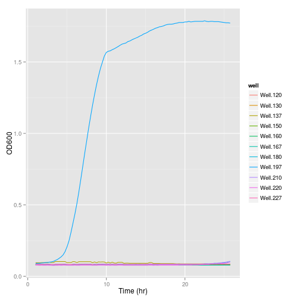
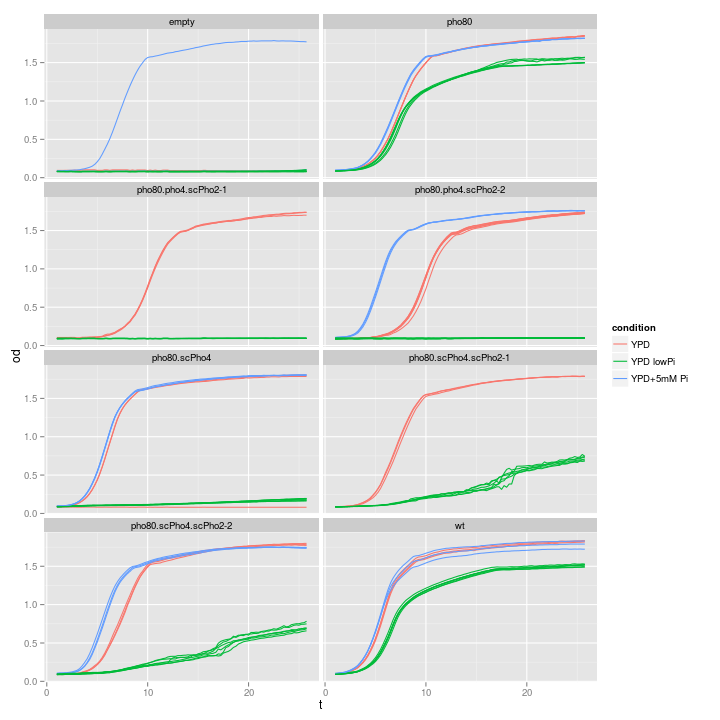
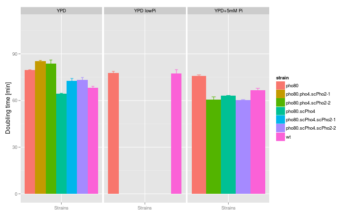

Growth curve analysis | data: 09/24/2013
========================================================
This script does some data plotting and quality check
for my first Bioscreen-C experiment  
hebin  
26 sep 2013  

Summary
------------------

Read data
------------------
Notes:  
* change the working directory
* replace the filename with the appropriate name

```r
raw <- read.csv("BioscreenExperiment20130924.csv")
# note: each column is temporal data for one well
time <- seq_len(nrow(raw))/4 - 0.25
data <- as.matrix(raw[, -1])
use.time <- 5:nrow(data)  # time axis: throw away first hour of data and the last time point
use.wells <- 11:130  # columns: discard the first column, or 10 wells, which are just water
data <- data[use.time, use.wells]
Time <- time[use.time]
attr(Time, "unit") <- "hr"
```


Design matrix
------------------
* define the strains
* define all factors involved
* setup the design matrix

```
## Well layout
```

```
## didn't inoculate column 8 (81-90). The first column is water.
```

```
##       [,1]    [,2]    [,3]     [,4]     [,5]    [,6]     [,7]     [,8]   
##  [1,] "empty" "CG1"   "CG21-1" "CG22-2" "CG1"   "CG21-1" "CG22-2" "CG1"  
##  [2,] "empty" "CG1"   "CG21-1" "CG22-2" "CG1"   "CG21-1" "CG22-2" "CG1"  
##  [3,] "empty" "CG1"   "CG21-1" "CG22-2" "CG1"   "CG21-1" "CG22-2" "CG1"  
##  [4,] "empty" "CG2"   "CG21-2" "CG21-2" "CG2"   "CG21-2" "CG21-2" "CG2"  
##  [5,] "empty" "CG2"   "CG21-2" "CG21-2" "CG2"   "CG21-2" "CG21-2" "CG2"  
##  [6,] "empty" "CG2"   "CG21-2" "CG21-2" "CG2"   "CG21-2" "CG21-2" "CG2"  
##  [7,] "empty" "CG9"   "CG22-1" "empty"  "CG9"   "CG22-1" "empty"  "CG9"  
##  [8,] "empty" "CG9"   "CG22-1" "NA"     "CG9"   "CG22-1" "NA"     "CG9"  
##  [9,] "empty" "CG9"   "CG22-1" "NA"     "CG9"   "CG22-1" "NA"     "CG9"  
## [10,] "empty" "empty" "empty"  "NA"     "empty" "empty"  "NA"     "empty"
##       [,9] [,10]    [,11]   [,12]    [,13]   
##  [1,] "NA" "CG22-2" "CG1"   "CG21-1" "CG22-2"
##  [2,] "NA" "CG22-2" "CG1"   "CG21-1" "CG22-2"
##  [3,] "NA" "CG22-2" "CG1"   "CG21-1" "CG22-2"
##  [4,] "NA" "CG21-2" "CG2"   "CG21-2" "CG21-2"
##  [5,] "NA" "CG21-2" "CG2"   "CG21-2" "CG21-2"
##  [6,] "NA" "CG21-2" "CG2"   "CG21-2" "CG21-2"
##  [7,] "NA" "empty"  "CG9"   "CG22-1" "empty" 
##  [8,] "NA" "NA"     "CG9"   "CG22-1" "NA"    
##  [9,] "NA" "NA"     "CG9"   "CG22-1" "NA"    
## [10,] "NA" "NA"     "empty" "empty"  "NA"
```

```
## Conditions
```

```
##  [1] "YPD"        "YPD"        "YPD"        "YPD lowPi"  "YPD lowPi" 
##  [6] "YPD lowPi"  "YPD+5mM Pi" "YPD+5mM Pi" "YPD+5mM Pi" "YPD lowPi" 
## [11] "YPD lowPi"  "YPD lowPi"
```


Functions
-----------------
1. Extract data
`getWell <- function(cond, strain, index, range=c(1:10))` extract one well's time series
`getExp <- function(strain, cond, range=NA)`  extract all tech. repl. of one strain x condition


2. Subfunction to summarize data
`myMeanSD <- function(x, d)`  summarize data
`myMelt <- function(x, d)`  summarize data

```
## Loading required package: reshape2
```


3. Simple plotting function
`simplot <- function(ex, mode="basic")` plot the raw data in either untransformed or log2 transformed format, can handle multiple wells simultaneously

```
## Loading required package: ggplot2
```


4. Estimate growth rate


Analyse
-----------------

### 0. Quality control
This time, some "empty" wells showed growth. In particular, the additional 3 columns of low Pi (well201-well230) seem to be most affected

```r
simplot(ex = getExp(strain = "empty", cond = 1:4, range = 1:100))
```

 


### 1. Overview and comparisons between strains / conditions
 


### 2. Estimate growth rate from the curve
In this section, I would like to compute two statistics for each growth curve
(1) Growth rate during the exponential stage, and
(2) Final biomass yield

For #1, the procedures are as follows
* Determine the linear range (there should be little lag time)
* Linear fit on log2(OD) ~ Time(hr)
* Extract the doubling time by calculating 1/coef(fit)[2]
* An alternative method is to calculate the derivative at discreet time points and take the maximum rate


```
##                  strain   YPD YPD lowPi YPD+5mM Pi
## 1                 pho80 79.47     77.68      75.80
## 2   pho80.pho4.scPho2-1 85.27   8695.45         NA
## 3   pho80.pho4.scPho2-2 83.72  10927.52      60.49
## 4          pho80.scPho4 64.50    868.41      63.08
## 5 pho80.scPho4.scPho2-1 72.78    259.37         NA
## 6 pho80.scPho4.scPho2-2 73.20    282.13      60.31
## 7                    wt 68.13     77.46      66.49
```

 

