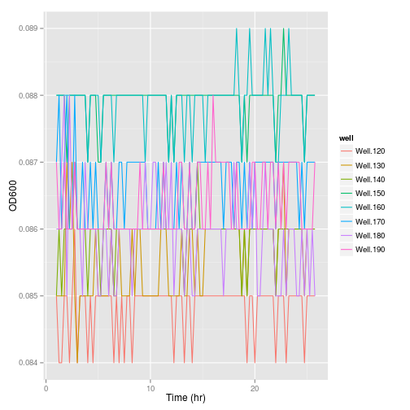
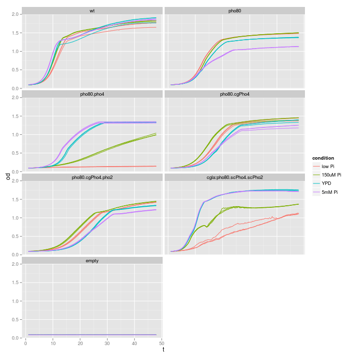
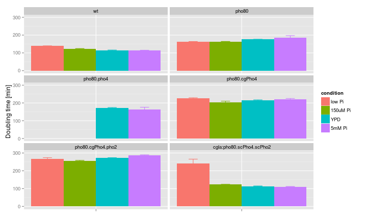

Growth curve analysis | data: 2013-10-04
========================================================
This script does some data plotting and quality check
for my first Bioscreen-C experiment  
hebin  
4 oct 2013  

Summary
------------------

Read data
------------------
Notes:  
* change the working directory
* replace the filename with the appropriate name

```r
setwd("~/Documents/work/Pho/Result/Multiple_stress_growth/20131004")
raw <- read.csv("BioscreenExperiment20131004.csv")
# note: each column is temporal data for one well
time <- seq_len(nrow(raw))/4 - 0.25
data <- as.matrix(raw[, -1])
use.time <- 5:nrow(data)  # time axis: throw away first hour of data and the last time point
use.wells <- 11:90  # columns: discard the first column, or 10 wells, which are just water
data <- data[use.time, use.wells]
Time <- time[use.time]
attr(Time, "unit") <- "hr"
```


Design matrix
------------------
* define the strains
* define all factors involved
* setup the design matrix

```
## Well layout
```

```
## didn't inoculate column 8 (81-90). The first column is water.
```

```
##       [,1]    [,2]    [,3]    [,4]    [,5]    [,6]    [,7]    [,8]   
##  [1,] "EY690" "XZ109" "EY690" "XZ109" "EY690" "XZ109" "EY690" "XZ109"
##  [2,] "EY690" "XZ109" "EY690" "XZ109" "EY690" "XZ109" "EY690" "XZ109"
##  [3,] "EY690" "XZ109" "EY690" "XZ109" "EY690" "XZ109" "EY690" "XZ109"
##  [4,] "XZ30"  "XZ112" "XZ30"  "XZ112" "XZ30"  "XZ112" "XZ30"  "XZ112"
##  [5,] "XZ30"  "XZ112" "XZ30"  "XZ112" "XZ30"  "XZ112" "XZ30"  "XZ112"
##  [6,] "XZ30"  "XZ112" "XZ30"  "XZ112" "XZ30"  "XZ112" "XZ30"  "XZ112"
##  [7,] "XZ33"  "CG22"  "XZ33"  "CG22"  "XZ33"  "CG22"  "XZ33"  "CG22" 
##  [8,] "XZ33"  "CG22"  "XZ33"  "CG22"  "XZ33"  "CG22"  "XZ33"  "CG22" 
##  [9,] "XZ33"  "CG22"  "XZ33"  "CG22"  "XZ33"  "CG22"  "XZ33"  "CG22" 
## [10,] "empty" "empty" "empty" "empty" "empty" "empty" "empty" "empty"
```

```
## Conditions
```

```
## [1] "low Pi"   "low Pi"   "150uM Pi" "150uM Pi" "YPD"      "YPD"     
## [7] "5mM Pi"   "5mM Pi"
```


Functions
-----------------
1. Extract data
`getWell <- function(cond, strain, index, range=c(1:10))` extract one well's time series
`getExp <- function(strain, cond, range=NA)`  extract all tech. repl. of one strain x condition


2. Subfunction to summarize data
`myMeanSD <- function(x, d)`  summarize data
`myMelt <- function(x, d)`  summarize data

```
## Loading required package: reshape2
```


3. Simple plotting function
`simplot <- function(ex, mode="basic")` plot the raw data in either untransformed or log2 transformed format, can handle multiple wells simultaneously

```
## Loading required package: ggplot2
```


4. Estimate growth rate


Analyse
-----------------

### 0. Quality control
This time, some "empty" wells showed growth. In particular, the additional 3 columns of low Pi (well201-well230) seem to be most affected

```r
simplot(ex = getExp(strain = "empty", cond = 1:4, range = 1:100))
```

 


### 1. Overview and comparisons between strains / conditions
 


### 2. Estimate growth rate from the curve
In this section, I would like to compute two statistics for each growth curve
(1) Growth rate during the exponential stage, and
(2) Final biomass yield

For #1, the procedures are as follows
* Determine the linear range (there should be little lag time)
* Linear fit on log2(OD) ~ Time(hr)
* Extract the doubling time by calculating 1/coef(fit)[2]
* An alternative method is to calculate the derivative at discreet time points and take the maximum rate


```
##                     strain low Pi 150uM Pi   YPD 5mM Pi
## 1                       wt  138.8    123.2 113.8  113.5
## 2                    pho80  162.0    163.7 175.6  186.2
## 3               pho80.pho4 1415.7    528.8 171.0  164.1
## 4             pho80.cgPho4  225.2    203.3 215.0  220.8
## 5        pho80.cgPho4.pho2  266.0    256.4 271.6  288.3
## 6 cgla:pho80.scPho4.scPho2  241.5    123.2 113.7  110.9
```

 

