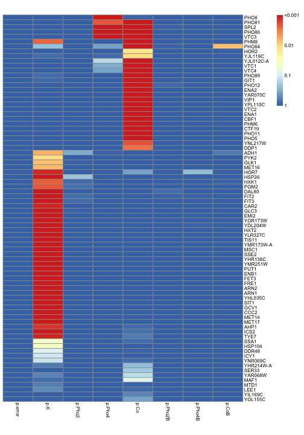

Analyze Xu's microarray data
========================================================

This script analyzes Xu's microarray data published in Zhou and O'Shea 2011, supplementary table 3
The goal is to understand genes induced by phosphate starvation either dependent or independent of Pho4


```r
setwd("~/Documents/work/Pho/Result/RNA-seq/Xu_microarray_Scer")
data <- read.table("sup_tab_3.txt", head = T, as.is = T)
require(pheatmap)
```

```
## Loading required package: pheatmap
```


_A large number of the genes respond to Pi starvation, but are not regulated by Pho4_
 

```
##         NAME     p.K p.Pho2  p.Pho4    p.Co p.Pho2B p.Pho4B  p.CoB
## 19      PHO8 1.0e+00   1.00 4.7e-11 9.1e-01    1.00    1.00 1.0000
## 28     PHO81 1.0e+00   1.00 1.2e-03 2.4e-07    1.00    1.00 1.0000
## 32      SPL2 9.9e-01   1.00 3.3e-05 0.0e+00    0.92    1.00 1.0000
## 40     PHO86 1.0e+00   1.00 2.7e-05 8.5e-13    1.00    1.00 1.0000
## 77      VTC3 1.0e+00   1.00 3.3e-16 0.0e+00    1.00    1.00 1.0000
## 23      PHM8 1.5e-03   1.00 1.0e+00 4.8e-08    1.00    1.00 1.0000
## 55     PHO84 2.2e-01   0.97 3.6e-01 7.5e-15    0.92    0.97 0.0066
## 24      HOR2 1.0e+00   1.00 1.0e+00 1.3e-02    1.00    1.00 1.0000
## 41   YJL119C 7.9e-01   1.00 8.7e-01 1.1e-02    1.00    1.00 1.0000
## 39 YJL012C-A 1.0e+00   1.00 1.5e-01 0.0e+00    1.00    1.00 1.0000
## 25      VTC1 9.8e-01   1.00 3.3e-01 1.1e-15    1.00    1.00 0.9900
## 38      VTC4 1.0e+00   1.00 3.6e-01 0.0e+00    1.00    1.00 1.0000
## 9      PHO89 7.6e-01   1.00 9.9e-01 0.0e+00    0.99    0.99 0.9900
## 11      GIT1 8.4e-01   0.99 9.7e-01 1.1e-16    0.98    0.97 1.0000
## 35     PHO12 1.0e+00   0.98 1.0e+00 0.0e+00    0.87    0.95 0.9900
## 15      ENA2 1.0e+00   1.00 1.0e+00 4.6e-10    0.99    1.00 1.0000
## 3    YAR070C 1.0e+00   1.00 1.0e+00 1.3e-06    1.00    1.00 1.0000
## 53      VIP1 1.0e+00   1.00 1.0e+00 1.6e-08    1.00    1.00 1.0000
## 79   YPL110C 1.0e+00   1.00 1.0e+00 2.3e-10    1.00    1.00 1.0000
## 26      VTC2 1.0e+00   1.00 1.0e+00 0.0e+00    1.00    1.00 1.0000
## 16      ENA1 1.0e+00   1.00 1.0e+00 4.3e-12    1.00    1.00 1.0000
## 42      CBF1 1.0e+00   1.00 1.0e+00 5.5e-12    1.00    1.00 1.0000
## 18      PHM6 1.0e+00   0.99 9.7e-01 0.0e+00    1.00    1.00 1.0000
## 76     CTF19 1.0e+00   0.98 9.9e-01 7.5e-13    1.00    1.00 1.0000
## 4      PHO11 1.0e+00   0.98 9.9e-01 0.0e+00    0.98    0.99 0.9600
## 6       PHO5 9.9e-01   0.99 9.6e-01 0.0e+00    1.00    0.96 0.9600
## 65   YNL217W 1.0e+00   1.00 1.0e+00 1.1e-03    1.00    1.00 1.0000
## 70      DDP1 1.0e+00   1.00 1.0e+00 1.9e-03    1.00    1.00 1.0000
## 67      ADH1 5.7e-03   0.32 9.2e-01 1.0e+00    1.00    1.00 0.6600
## 73      PYK2 1.1e-02   0.99 1.0e+00 1.0e+00    1.00    1.00 1.0000
## 10      GLK1 6.8e-03   0.93 1.0e+00 1.0e+00    1.00    1.00 1.0000
## 80     MET16 6.0e-03   1.00 1.0e+00 1.0e+00    1.00    1.00 1.0000
## 64      HOR7 2.2e-04   0.99 1.0e+00 3.6e-01    0.99    0.25 1.0000
## 5      HSP26 4.8e-11   0.21 9.5e-01 1.0e+00    1.00    0.95 0.9900
## 27      HXK1 1.3e-03   0.77 1.0e+00 1.0e+00    1.00    1.00 0.8900
## 59      PGM2 1.2e-03   0.73 1.0e+00 1.0e+00    1.00    1.00 0.9400
## 44     DAL80 9.8e-10   1.00 1.0e+00 1.0e+00    0.76    1.00 0.9700
## 74      FIT2 1.9e-14   0.81 9.7e-01 1.0e+00    0.90    0.92 0.9900
## 75      FIT3 2.3e-15   0.79 1.0e+00 1.0e+00    1.00    1.00 1.0000
## 54      CAR2 1.5e-04   1.00 1.0e+00 1.0e+00    0.99    1.00 0.9900
## 21      GLC3 1.0e-08   0.92 1.0e+00 1.0e+00    1.00    1.00 1.0000
## 20      EMI2 1.9e-07   0.95 1.0e+00 1.0e+00    1.00    1.00 1.0000
## 71   YOR173W 5.6e-06   0.97 1.0e+00 1.0e+00    1.00    1.00 1.0000
## 12   YDL204W 6.7e-16   1.00 1.0e+00 1.0e+00    1.00    0.93 1.0000
## 57      HXT2 2.1e-11   1.00 1.0e+00 1.0e+00    0.95    1.00 1.0000
## 52   YLR327C 9.2e-14   0.99 1.0e+00 1.0e+00    1.00    0.97 0.9900
## 48     TIS11 0.0e+00   1.00 9.8e-01 9.9e-01    1.00    1.00 1.0000
## 61 YMR173W-A 1.4e-06   1.00 1.0e+00 9.8e-01    1.00    1.00 1.0000
## 56      MSC1 2.7e-14   1.00 1.0e+00 1.0e+00    1.00    0.99 1.0000
## 8       SSE2 7.1e-08   1.00 1.0e+00 1.0e+00    1.00    1.00 0.9900
## 33   YHR138C 9.2e-07   1.00 1.0e+00 1.0e+00    1.00    1.00 1.0000
## 63   YMR251W 9.9e-11   1.00 1.0e+00 1.0e+00    1.00    1.00 1.0000
## 49      PUT1 1.4e-12   1.00 1.0e+00 1.0e+00    1.00    1.00 1.0000
## 69      ENB1 0.0e+00   1.00 1.0e+00 1.0e+00    1.00    1.00 1.0000
## 58      FET3 0.0e+00   1.00 1.0e+00 1.0e+00    1.00    1.00 1.0000
## 50      FRE1 0.0e+00   1.00 1.0e+00 1.0e+00    1.00    1.00 1.0000
## 31      ARN2 0.0e+00   1.00 1.0e+00 1.0e+00    1.00    1.00 1.0000
## 30      ARN1 0.0e+00   1.00 1.0e+00 1.0e+00    1.00    1.00 1.0000
## 29   YHL035C 0.0e+00   1.00 1.0e+00 1.0e+00    1.00    1.00 1.0000
## 22      SIT1 0.0e+00   1.00 1.0e+00 1.0e+00    1.00    1.00 1.0000
## 14      GCV1 0.0e+00   1.00 1.0e+00 1.0e+00    1.00    1.00 1.0000
## 17      CCC2 0.0e+00   1.00 1.0e+00 1.0e+00    1.00    1.00 1.0000
## 43     MET14 2.7e-13   1.00 1.0e+00 1.0e+00    1.00    1.00 1.0000
## 51     MET17 4.0e-13   1.00 1.0e+00 1.0e+00    1.00    1.00 1.0000
## 47      AHP1 5.0e-04   1.00 1.0e+00 7.6e-01    1.00    1.00 0.9800
## 7       ICS2 3.1e-07   1.00 1.0e+00 7.3e-01    1.00    1.00 1.0000
## 72      TYE7 1.5e-04   1.00 1.0e+00 6.2e-01    1.00    1.00 0.9900
## 1       SSA1 4.4e-02   0.98 1.0e+00 7.7e-01    1.00    1.00 1.0000
## 46    HSP104 3.9e-02   1.00 1.0e+00 1.0e+00    1.00    1.00 1.0000
## 60     DDR48 8.8e-02   1.00 1.0e+00 9.3e-01    1.00    1.00 1.0000
## 62      ICY1 1.1e-01   1.00 1.0e+00 9.6e-01    1.00    1.00 1.0000
## 66   YNR069C 1.2e-01   0.99 1.0e+00 7.9e-01    1.00    1.00 1.0000
## 34 YHR214W-A 6.5e-01   1.00 1.0e+00 2.4e-01    1.00    0.98 1.0000
## 36     SER33 9.9e-01   1.00 1.0e+00 1.9e-01    1.00    1.00 1.0000
## 2    YAR068W 5.7e-01   1.00 1.0e+00 1.4e-01    1.00    0.98 1.0000
## 13      MAF1 8.0e-01   1.00 1.0e+00 8.8e-02    1.00    1.00 1.0000
## 45      MTD1 6.0e-01   1.00 1.0e+00 9.0e-01    1.00    1.00 1.0000
## 78      LEE1 5.1e-01   0.94 1.0e+00 8.6e-01    1.00    1.00 0.9900
## 37   YIL169C 9.8e-01   1.00 1.0e+00 5.4e-01    1.00    1.00 1.0000
## 68   YOL155C 9.3e-01   1.00 1.0e+00 3.7e-01    1.00    1.00 1.0000
```


