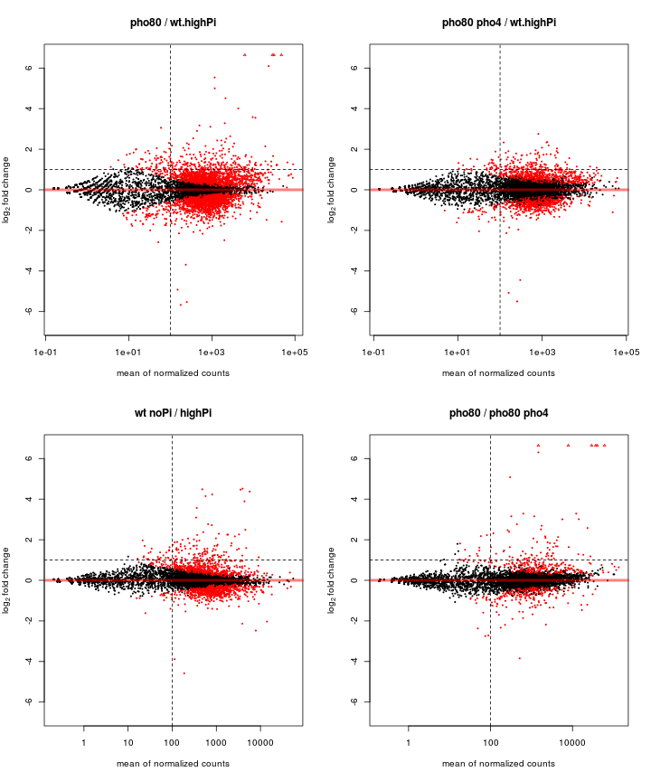
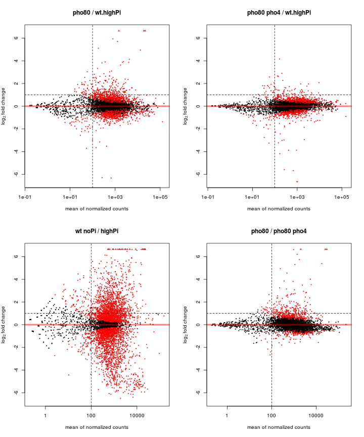

RNASeq_analysis | data: 11/13/2013
========================================================
This script takes in raw counts and determine Differential Expression (DE) 
for every gene of interest.
Data-wise, it combines the 06/15/2013 and 11/13/2013 data
hebin
18 nov 2013
Read data
------------------


Use DESeq
------------------
### 1. Subfunctions for calculating pairwiseDE

```r
# Function for calculating DE genes given the data, design
PairwiseDE <- function(countTable, design, cond.A, cond.B) {
    index.A <- which(design == cond.A)
    index.B <- which(design == cond.B)
    subTable <- countTable[, c(index.A, index.B)]
    conditions <- factor(c(rep(cond.A, length(index.A)), rep(cond.B, length(index.B))))
    cds <- newCountDataSet(subTable, conditions)
    cds <- estimateSizeFactors(cds)
    cds <- estimateDispersions(cds)
    res = nbinomTest(cds, cond.A, cond.B)
    res1 <- res[!is.na(res$padj), ]
    return(res)
}

# Function to report significant genes at a given fdr and log2FoldChange
# threshold
sigGene <- function(res, fdr = 0.05, log2FoldChange = 1, direction = "up", baseMean = 0) {
    par <- paste("sigGene --fdr=", fdr, " --foldchange=", 2^log2FoldChange, 
        " --direction=", direction, " --baseMean=", baseMean, sep = "", collapse = "")
    if (direction != "up" & direction != "down") {
        list = rep(FALSE, nrow(res))
    } else if (direction == "up") {
        list = res$padj < fdr & res$log2FoldChange > log2FoldChange & res$baseMean > 
            baseMean
    } else if (direction == "down") {
        list = res$padj < fdr & res$log2FoldChange < -log2FoldChange & res$baseMean > 
            baseMean
    }
    list = replace(list, is.na(list), FALSE)
    attr(list, "par") <- par
    cat(par)
    return(list)
}
# Use DESeq2 to call significantly DE genes
PairwiseDE2 <- function(countTable, design, cond.A, cond.B) {
    index.A <- which(design == cond.A)
    index.B <- which(design == cond.B)
    subTable <- countTable[, c(index.A, index.B)]
    conditions <- factor(c(rep(cond.A, length(index.A)), rep(cond.B, length(index.B))), 
        levels = c(cond.A, cond.B))
    colData <- DataFrame(condition = conditions)
    dds <- DESeqDataSetFromMatrix(countData = subTable, colData = colData, design = ~condition)
    dds <- DESeq(dds)
    return(dds)
}
# Compare two lists
compList <- function(listA, listB, total = 0) {
    res <- list(common = intersect(listA, listB), A.only = setdiff(listA, listB), 
        B.only = setdiff(listB, listA))
    len <- sapply(res, length)
    cat(paste(c("In both", " A only", " B only"), len, sep = ":", collapse = "\n"))
    if (total) {
        # if total # of genes is given, calculate the enrichment factor and p-value
        # from hypergeometric dist.
        expect <- length(listB)/total * length(listA)
        enrich <- round(len["common"]/expect, 1)
        p.hypergeom <- phyper(q = len["common"], m = length(listB), n = total - 
            length(listB), k = length(listA), lower.tail = F)
        cat("\n\n")
        cat(sprintf("Enrichment factor: %.1f\np< %.2g", enrich, p.hypergeom))
    }
    return(res)
}
```


### 2. Actual analysis of the data
#### 2.1 Compare scPho4 targets in _pho80_ vs. under starvation in Scer
_Question: what genes change their expression in pho80 bg vs. those under starvation? Which of them are PHO genes, i.e. dependent on Pho4?_

```
## Identify genes in pho80_del in Scer...
```

```
## sigGene --fdr=0.05 --foldchange=2 --direction=up --baseMean=100
```

```
## sigGene --fdr=0.05 --foldchange=2 --direction=down --baseMean=100
```

```
## Identify genes under starvation in Scer...
```

```
## sigGene --fdr=0.05 --foldchange=2 --direction=up --baseMean=100
```

```
## sigGene --fdr=0.05 --foldchange=2 --direction=down --baseMean=100
```

```
## Identify genes dependent on Pho4 in pho80- bg in Scer...
```

```
## sigGene --fdr=0.05 --foldchange=2 --direction=up --baseMean=100
```

```
## sigGene --fdr=0.05 --foldchange=2 --direction=down --baseMean=100
```

```
## Identify genes dependent on Pho4 in pho80- bg in Scer...
```

```
## sigGene --fdr=0.05 --foldchange=2 --direction=up --baseMean=100
```

```
## sigGene --fdr=0.05 --foldchange=2 --direction=down --baseMean=100
```


```
## Compare pho80- and Pi starvation genes
```

```
##        noPi
## pho80   FALSE TRUE  Sum
##   FALSE  6311   53 6364
##   TRUE    178   61  239
##   Sum    6489  114 6603
```

 


```r
cat("Genes defined by Xu and found in starvation conditions ...")
```

```
## Genes defined by Xu and found in starvation conditions ...
```

```r
tmp <- compList(gene$sc.sc4.no80, gene$sc.sc4.noPi, 6603)
```

```
## In both:61
##  A only:178
##  B only:53
## 
## Enrichment factor: 14.8
## p< 2.4e-61
```

```r
gene.list <- cbind(sig$sc.sc4.no80, sig$sc.sc4.noPi, sig$sc.sc4.no80 & !sig$sc.sc4.no80no4, 
    FALSE)
rownames(gene.list) <- sc.genes
colnames(gene.list) <- c("pho80", "no Pi", "require Pho4", "Xu Pho4-genes")
gene.list[all.80, 4] <- TRUE
vennCounts <- vennCounts(gene.list[, -1])
```

```
## Error: could not find function "vennCounts"
```

```r
vennDiagram(vennCounts, circle.col = c("black", "blue", "green"))
```

```
## Error: could not find function "vennDiagram"
```


#### 2.2 Compare cgPho4 targets in _pho80_ vs. under starvation in Cgla

```
## Identify genes in pho80_del in Cgla...
```

```
## sigGene --fdr=0.05 --foldchange=2 --direction=up --baseMean=100
```

```
## sigGene --fdr=0.05 --foldchange=2 --direction=down --baseMean=100
```

```
## Identify genes under starvation in Cgla...
```

```
## sigGene --fdr=0.05 --foldchange=2 --direction=up --baseMean=100
```

```
## sigGene --fdr=0.05 --foldchange=2 --direction=down --baseMean=100
```

```
## Identify genes dependent on Pho4 in pho80- bg in cgla...
```

```
## sigGene --fdr=0.05 --foldchange=2 --direction=up --baseMean=100
```

```
## sigGene --fdr=0.05 --foldchange=2 --direction=down --baseMean=100
```

```
## Identify genes dependent on Pho4 in pho80- bg in cgla...
```

```
## sigGene --fdr=0.05 --foldchange=2 --direction=up --baseMean=100
```

```
## sigGene --fdr=0.05 --foldchange=2 --direction=down --baseMean=100
```


```
## Compare pho80- and Pi starvation genes
```

```
##        noPi
## pho80   FALSE TRUE  Sum
##   FALSE  6311   53 6364
##   TRUE    178   61  239
##   Sum    6489  114 6603
```

 


