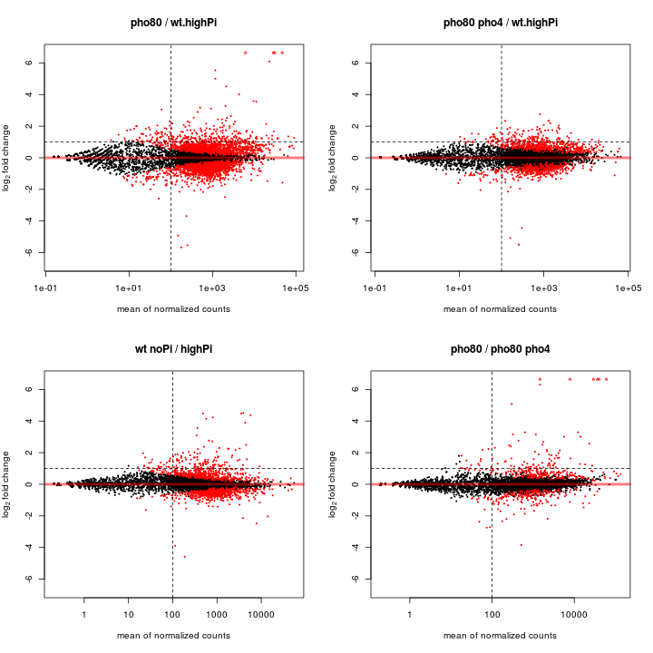

RNASeq_analysis | data: 11/13/2013
========================================================
This script takes in raw counts and determine Differential Expression (DE) 
for every gene of interest.
Data-wise, it combines the 06/15/2013 and 11/13/2013 data
hebin
18 nov 2013
Read data
------------------

```r
library(limma)  # note: here the loading order is important. If limma is loaded last, it will mask the plotMA function
library(DESeq2)  #       from DESeq2
setwd("~/Documents/work/Pho/Result/RNA-seq/main")
```

```
## Error: cannot change working directory
```

```r
# Scer
sc.sense <- read.csv("ScerRNAseq_sense.csv", row.names = 1)
# sc.anti <- read.csv('ScerRNAseq_anti.csv',row.names=1)
sc.info <- read.table("ScerRNAseq_sample_info.txt", col.names = c("Sample", 
    "Genotype", "Size"), as.is = TRUE)
sc.genes <- rownames(sc.sense)

# Cgla
cg.sense <- read.csv("CglaRNAseq_sense.csv", row.names = 1)
# cg.anti <- read.csv('CglaRNAseq_anti.csv',row.names=1)
cg.info <- read.table("CglaRNAseq_sample_info.txt", col.names = c("Sample", 
    "Genotype", "Size"), as.is = TRUE)
cg.genes <- rownames(cg.sense)

# misc annotation stuff convert Cgla genes to orthologs in Scer, based on
# orthogroup assignment from Aviv's database note that for genes with more
# than one potential orthologs, the first one in the list is used
cg.sc.ortholog <- read.table("Cgla-Scer-orthologs.txt", na.string = "NONE", 
    fill = TRUE, as.is = TRUE)
cgToSc <- cg.sc.ortholog$V2
names(cgToSc) <- cg.sc.ortholog$V1

sgdName <- read.table("sgdToName.txt", as.is = TRUE)
sgdToName <- sgdName$V2
names(sgdToName) <- sgdName$V1
nameToSgd <- sgdName$V1
names(nameToSgd) <- sgdName$V2

xu.genes <- c("PHO8", "VTC3", "SPL2", "PHO81", "PHO86", "PHO5", "PHO11", "PHO84", 
    "PHO89", "PHM6", "PHO12", "GIT1", "VTC1", "VTC4", "CTF19", "YAR070C", "ENA2", 
    "VTC2", "ENA1", "GDE1", "PHM8", "VIP1", "CBF1", "DDP1", "YJL119C", "HOR2", 
    "YNL217W")
Xu.genes <- nameToSgd[xu.genes]
all.80 <- c("YAL005C", "YAR068W", "YAR070C", "YAR071W", "YBR072W", "YBR093C", 
    "YBR157C", "YBR169C", "YBR296C", "YCL040W", "YCR098C", "YDL204W", "YDR005C", 
    "YDR019C", "YDR039C", "YDR040C", "YDR270W", "YDR281C", "YDR481C", "YDR516C", 
    "YEL011W", "YEL065W", "YER037W", "YER062C", "YER072W", "YFL004W", "YFR053C", 
    "YGR233C", "YHL035C", "YHL040C", "YHL047C", "YHR136C", "YHR138C", "YHR214W-A", 
    "YHR215W", "YIL074C", "YIL169C", "YJL012C", "YJL117W", "YJL119C", "YJR060W", 
    "YKL001C", "YKR034W", "YKR080W", "YLL026W", "YLR109W", "YLR136C", "YLR142W", 
    "YLR214W", "YLR303W", "YLR327C", "YLR410W", "YLR438W", "YML123C", "YML128C", 
    "YMR011W", "YMR058W", "YMR105C", "YMR173W", "YMR173W-A", "YMR195W", "YMR251W", 
    "YMR251W-A", "YNL217W", "YNR069C", "YOL086C", "YOL155C", "YOL158C", "YOR163W", 
    "YOR173W", "YOR344C", "YOR347C", "YOR382W", "YOR383C", "YPL018W", "YPL019C", 
    "YPL054W", "YPL110C", "YPR167C")
```


Use DESeq
------------------
### 1. Subfunctions for calculating pairwiseDE

```r
# Function for calculating DE genes given the data, design
PairwiseDE <- function(countTable, design, cond.A, cond.B) {
    index.A <- which(design == cond.A)
    index.B <- which(design == cond.B)
    subTable <- countTable[, c(index.A, index.B)]
    conditions <- factor(c(rep(cond.A, length(index.A)), rep(cond.B, length(index.B))))
    cds <- newCountDataSet(subTable, conditions)
    cds <- estimateSizeFactors(cds)
    cds <- estimateDispersions(cds)
    res = nbinomTest(cds, cond.A, cond.B)
    res1 <- res[!is.na(res$padj), ]
    return(res)
}

# Function to report significant genes at a given fdr and log2FoldChange
# threshold
sigGene <- function(res, fdr = 0.05, log2FoldChange = 1, direction = "up", baseMean = 0) {
    par <- paste("sigGene --fdr=", fdr, " --foldchange=", 2^log2FoldChange, 
        " --direction=", direction, " --baseMean=", baseMean, sep = "", collapse = "")
    if (direction != "up" & direction != "down") {
        list = rep(FALSE, nrow(res))
    } else if (direction == "up") {
        list = res$padj < fdr & res$log2FoldChange > log2FoldChange & res$baseMean > 
            baseMean
    } else if (direction == "down") {
        list = res$padj < fdr & res$log2FoldChange < -log2FoldChange & res$baseMean > 
            baseMean
    }
    list = replace(list, is.na(list), FALSE)
    attr(list, "par") <- par
    cat(par)
    return(list)
}
# Use DESeq2 to call significantly DE genes
PairwiseDE2 <- function(countTable, design, cond.A, cond.B) {
    index.A <- which(design == cond.A)
    index.B <- which(design == cond.B)
    subTable <- countTable[, c(index.A, index.B)]
    conditions <- factor(c(rep(cond.A, length(index.A)), rep(cond.B, length(index.B))), 
        levels = c(cond.A, cond.B))
    colData <- DataFrame(condition = conditions)
    dds <- DESeqDataSetFromMatrix(countData = subTable, colData = colData, design = ~condition)
    dds <- DESeq(dds)
    return(dds)
}
# Compare two lists
compList <- function(listA, listB, total = 0) {
    res <- list(common = intersect(listA, listB), A.only = setdiff(listA, listB), 
        B.only = setdiff(listB, listA))
    len <- sapply(res, length)
    cat(paste(c("In both", " A only", " B only"), len, sep = ":", collapse = "\n"))
    if (total) {
        # if total # of genes is given, calculate the enrichment factor and p-value
        # from hypergeometric dist.
        expect <- length(listB)/total * length(listA)
        enrich <- round(len["common"]/expect, 1)
        p.hypergeom <- phyper(q = len["common"], m = length(listB), n = total - 
            length(listB), k = length(listA), lower.tail = F)
        cat("\n\n")
        cat(sprintf("Enrichment factor: %.1f\np< %.2g", enrich, p.hypergeom))
    }
    return(res)
}
```


### 2. Actual analysis of the data
#### 2.1 Compare scPho4 targets in _pho80_ vs. under starvation
_Question: what genes are regulated in common vs. differently?_

```
## Identify genes in pho80_del in Scer...
```

```
## sigGene --fdr=0.05 --foldchange=2 --direction=up --baseMean=100
```

```
## sigGene --fdr=0.05 --foldchange=2 --direction=down --baseMean=100
```

```
## Identify genes under starvation in Scer...
```

```
## sigGene --fdr=0.05 --foldchange=2 --direction=up --baseMean=100
```

```
## sigGene --fdr=0.05 --foldchange=2 --direction=down --baseMean=100
```

```
## Compare pho80- and Pi starvation genes
```

```
##        noPi
## pho80   FALSE TRUE  Sum
##   FALSE  6311   53 6364
##   TRUE    178   61  239
##   Sum    6489  114 6603
```

```
## Error: no method for coercing this S4 class to a vector
```

```
## Error: no method for coercing this S4 class to a vector
```

```
## Genes defined by Xu and found in starvation conditions ...
```

```
## In both:61
##  A only:178
##  B only:53
## 
## Enrichment factor: 14.8
## p< 2.4e-61
```

 


